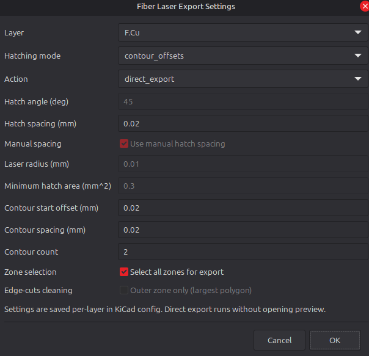
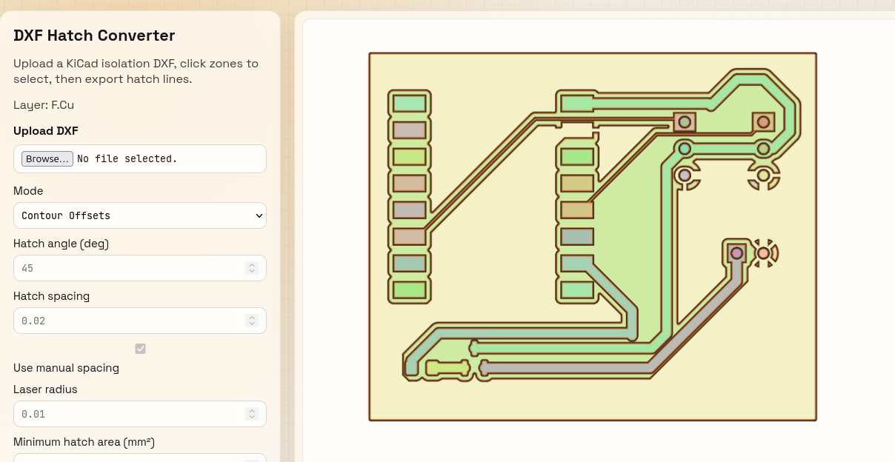
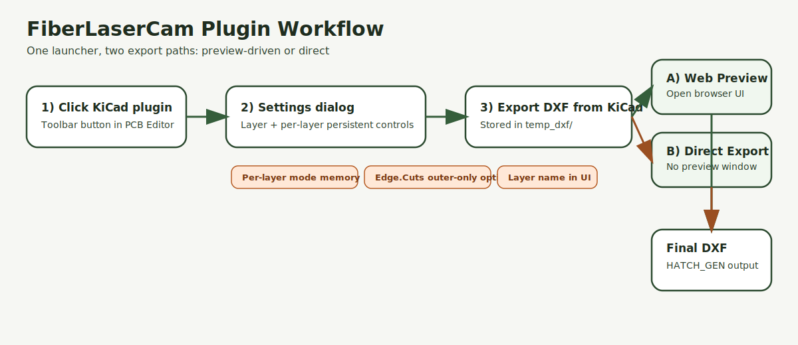
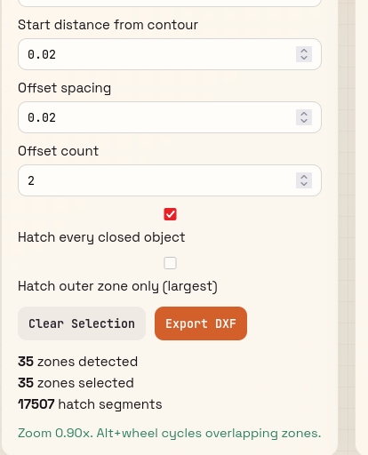
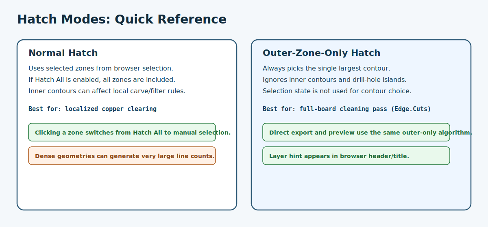

# Fiber Laser DXF Hatch Tool

Local Python web app for converting selected closed DXF zones into hatch lines for fiber laser etching.

## Quick Start (With Pictures)

1. In KiCad PCB Editor, click the Fiber Laser plugin button.
2. In the settings dialog, choose the layer and export action.
3. For full-board cleanup, select `Edge.Cuts` and enable `Outer zone only (largest polygon)`.
4. Use `web_preview` to tune interactively, or `direct_export` to save immediately.



5. In the browser view, verify zones/preview and export the final DXF.



## Features

- Upload KiCad-generated DXF isolation files
- Detect closed zones from polylines, circles, and closed linework
- Visualize each zone with unique colors
- Click zones to select/unselect for hatching
- Preview generated hatch lines with controls:
  - Hatch angle (degrees)
  - Hatch spacing
  - Laser radius (inward offset)
- Export a DXF with hatch lines added on layer `HATCH_GEN`

## Preferred Workflow

The recommended entry point is the KiCad ActionPlugin.

1. Click the Fiber Laser launcher button in KiCad PCB Editor.
2. Pick the export layer. The default is `F.Cu`.
3. The plugin exports a temporary DXF, starts the local web server, and opens your browser.
4. Use the browser UI to select zones, tune hatch or contour settings, preview, and export.
5. Closing the browser tab stops the temporary server automatically.

## Visual Guide

### Workflow Overview



### KiCad Settings Dialog


### Web Interface




### Hatch Mode Behavior



## Run

```bash
python3 -m venv .venv
source .venv/bin/activate
pip install -r requirements.txt
python app.py
```

Open: http://127.0.0.1:5000

## Browser Defaults

- Hatch spacing defaults to `0.02 mm`.
- Contour offset start defaults to `0.02 mm`.
- Contour offset spacing defaults to `0.02 mm`.

## Notes

- Works best with DXF files containing closed contours or linework that forms closed polygons.
- Very complex DXF files may produce many tiny zones; use click selection to choose only desired areas.

## KiCad Plugin

A KiCad ActionPlugin lives in the repo root and launches the browser workflow from KiCad, exports the selected layer to DXF, and then hands off control to the local web app.

### Install As KiCad Plugin

Use this when you want the toolbar button inside KiCad.

1. Close KiCad.
2. Create a plugin folder named `fiberlasercam` in your KiCad user plugin directory.
3. Copy this repository contents into that folder, preserving structure.
4. Start KiCad and open PCB Editor.
5. Use `Tools -> External Plugins -> Refresh Plugins`, or restart KiCad if needed.
6. Confirm the Fiber Laser toolbar button appears.

Linux (KiCad 10 user path):

```bash
mkdir -p ~/.local/share/kicad/10.0/scripting/plugins/fiberlasercam
rsync -a --delete ./ ~/.local/share/kicad/10.0/scripting/plugins/fiberlasercam/
```

Windows (typical user path):

```text
%APPDATA%\kicad\10.0\scripting\plugins\fiberlasercam
```

macOS (typical user path):

```text
~/Library/Application Support/kicad/10.0/scripting/plugins/fiberlasercam
```

If the button does not appear:

- Check that `__init__.py` is in the root of `fiberlasercam`.
- Check that `fiber_laser_plugin.py` is alongside `__init__.py`.
- Check KiCad's plugin console for Python import errors.
- Re-run plugin refresh after any file changes.

### PCM Package Notes

- KiCad toolbar button icon and PCM package icon are different assets.
- Toolbar icon comes from `plugins/icon_fiber_laser.xpm`.
- PCM package icon comes from `resources/icon.png` inside the release zip.
- PCM icon source file is `packaging/icon.png`.
- Metadata source file is `packaging/metadata.template.json`.

About metadata `kicad_version`:

- `kicad_version: "9.0"` means minimum supported KiCad version is 9.0.
- It does not limit the workflow build itself to only KiCad 9.
- Because no `kicad_version_max` is set, newer KiCad versions can still install it.

Launcher behavior:

- Shows a KiCad dialog with per-layer persistent settings.
- Saves mode and parameters per layer (hatch or contour offset).
- Supports two actions: `web_preview` (open browser) and `direct_export` (export immediately without preview).
- Passes selected layer and mode/parameter hints to the web app via query parameters.
- Stores temporary exported DXF files in `temp_dxf/`.

### Settings Reference And Cutting Impact

These settings exist in the KiCad launcher dialog and/or browser UI. The cutting impact notes describe common real-world outcomes when values are too aggressive.

#### Core Launcher Settings

- `Layer`
  - What it does: chooses the KiCad layer exported to DXF.
  - Cutting impact: wrong layer can include geometry you did not intend to process.

- `Action`
  - `web_preview`: open browser, inspect zones, preview output before export.
  - `direct_export`: run export immediately without browser interaction.
  - Cutting impact: direct export is faster but easier to run with unsafe density if settings were not checked.

- `Hatching mode`
  - `hatch`: generates line hatch fills.
  - `contour_offsets`: generates inward contour loops.
  - Cutting impact: hatch usually deposits more heat over area; contour offsets may reduce fill density but can still overheat if spacing is tight.

#### Hatch Mode Settings

- `Hatch angle (deg)`
  - What it does: rotates hatch line direction.
  - Cutting impact: repeating the same angle across multiple passes can reinforce heat bands; changing angle can distribute thermal load.

- `Hatch spacing (mm)`
  - What it does: distance between adjacent hatch lines.
  - Cutting impact: smaller spacing means denser lines, more dwell, more heat accumulation, higher risk of discoloration, overburn, or burn-through.

- `Use manual spacing`
  - What it does: toggles fixed spacing instead of automatic spacing from laser radius.
  - Cutting impact: manual settings can improve control, but unsafe small values can dramatically increase energy per area.

- `Laser radius (mm)`
  - What it does: used for auto spacing and inward geometry allowance.
  - Cutting impact: if radius is set too small for the actual beam, passes overlap more than expected and can char or overcut.

- `Minimum hatch area (mm^2)`
  - What it does: filters tiny regions out of hatch generation.
  - Cutting impact: lower values include narrow slivers that can overheat quickly and produce rough results.

- `Select all zones for export`
  - What it does: hatch every detected closed zone.
  - Cutting impact: can greatly increase total path length and heat input if many small islands exist.

- `Outer zone only (largest polygon)`
  - What it does: hatches only the largest contour and ignores inner contours for contour choice.
  - Cutting impact: useful for board-wide cleaning passes; reduces accidental focus on holes/islands.

#### Contour Offset Mode Settings

- `Contour start offset (mm)`
  - What it does: first inward offset distance from contour edge.
  - Cutting impact: too small can overwork edge-adjacent material and increase edge darkening.

- `Contour spacing (mm)`
  - What it does: gap between each offset loop.
  - Cutting impact: tighter spacing increases loop count per area and heat accumulation.

- `Contour count`
  - What it does: number of inward loops.
  - Cutting impact: higher count increases total exposure time and can cause burn-through on thin stock.

- `Invert offset direction (toward interior)`
  - What it does: flips contour offset direction from expansion to contraction.
  - Cutting impact: useful for processing hole-like features where offsets should move inward from boundary.
  - Drill-hole use: enable this when you want offset passes to tighten toward hole centers instead of growing outward.

### Practical Process Guidance

- Start with wider spacing and lower loop count, then tighten gradually.
- Run a small test coupon on the same material before full-board processing.
- Watch for browning, deep char, or edge collapse as early signs of too much energy density.
- If overburn appears, increase spacing, reduce passes, or increase feed speed / reduce power on your machine.
- For drill-hole contour processing, start with small count and conservative spacing when using inverted direction.

### Edge.Cuts Cleaning Pass

For full-board cleanup style hatching:

1. Select layer `Edge.Cuts`.
2. Set mode to `hatch`.
3. Enable `Outer zone only (largest polygon)`.
4. Export using preview mode or direct export.

Behavior in this mode:

- The tool picks the single largest contour.
- Inner contours are ignored.
- Drill-hole islands are ignored for contour choice.

## Repository Layout

Keep the top-level bundle layout together when installing or packaging:

- `__init__.py`
- `fiber_laser_plugin.py`
- `offline_export.py`
- `contour_offsets.py`
- `icon_fiber_laser.xpm`
- `app.py`
- `templates/`
- `static/`

That is the clean install shape, so the browser app and the KiCad launcher stay side by side in the same folder tree.

## License

This project is licensed under the Apache License 2.0.

See [LICENSE](LICENSE) for the full text.
