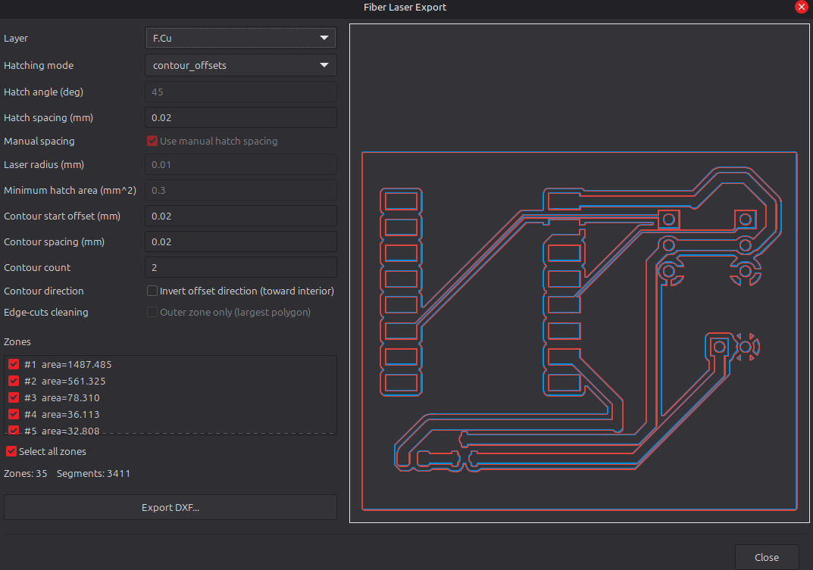
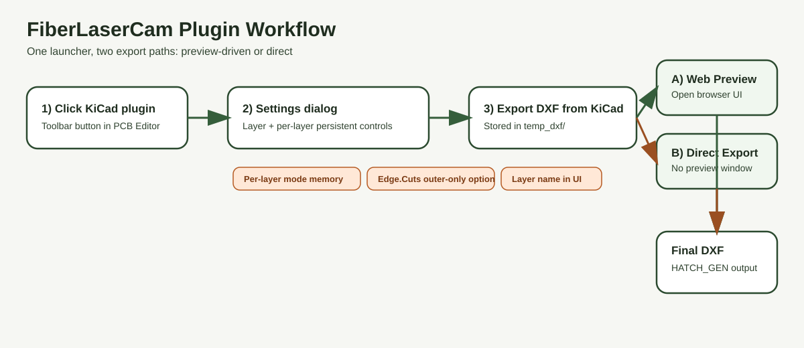
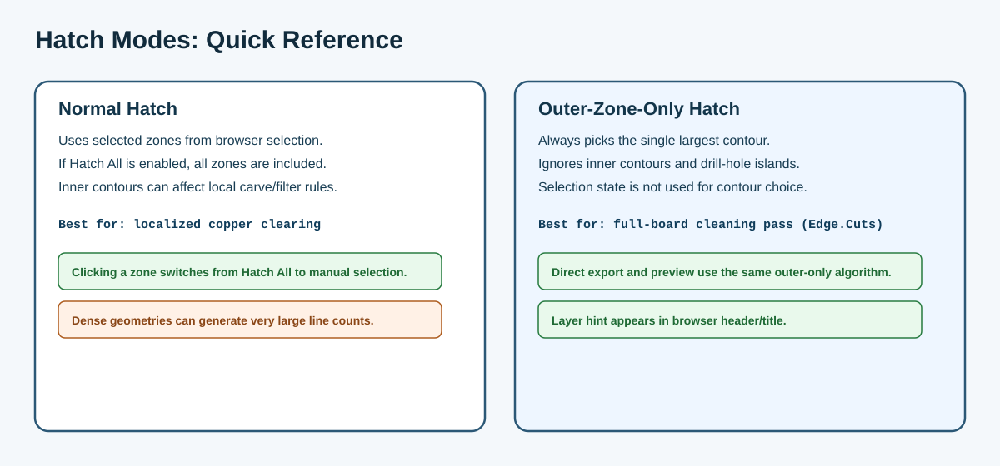

# Fiber Laser DXF Hatch Tool

KiCad plugin for converting PCB geometry into hatch lines or contour offsets for fiber laser etching, with a built-in preview and export dialog.

## Quick Start (With Pictures)

1. In KiCad PCB Editor, click the Fiber Laser plugin button.
2. In the settings dialog, choose the layer, mode, and parameters.
3. For full-board cleanup, select `Edge.Cuts` and enable `Outer zone only (largest polygon)`.
4. Click **Preview** to review the output inline, or **Export** to save immediately.
5. Use **Export All Layers...** to export F.Cu, B.Cu, Edge.Cuts, F.Mask, B.Mask, and drill holes to separate DXF files in one go.



## Features

- Detect closed zones from polylines, circles, and closed linework
- Visualize each zone with unique colors inside the dialog
- Select or deselect individual zones for processing
- Pan (drag) and zoom (scroll wheel, cursor-centered) the preview canvas; double-click or middle-click to reset the view
- Preview generated hatch lines or contour offsets inline with controls:
  - Hatch angle (degrees), or overlay 0/45/90 degree passes with multi-angle hatch
  - Hatch spacing
  - Laser radius (inward offset)
  - Invert alternate-nesting parity for text-style hatching
- Drill holes can use regular concentric contour loops (default) or inward spirals
- Contour offsets automatically trim themselves locally where they'd meet a nearby feature (e.g. close pads, or a long trace passing near a pad) instead of overlapping and overcutting the material, without cutting short the rest of the contour away from the conflict
- Export a DXF with hatch lines or offsets added on layer `HATCH_GEN`, or export every standard layer to its own DXF file with **Export All Layers...**
- Every exported DXF gets tiny corner alignment marks 1mm outside the board's own Edge.Cuts bounding box, so all exported files share an identical overall bounding box. Some fiber laser controllers compute their own bounding box per loaded file and center/align the job on it instead of trusting the file's coordinates; without these marks, layers whose actual geometry differs (e.g. F.Mask vs. drill holes) can end up centered slightly differently and drift out of alignment with each other.

## Preferred Workflow

The recommended entry point is the KiCad ActionPlugin.

1. Click the Fiber Laser launcher button in KiCad PCB Editor.
2. Pick the export layer. The default is `F.Cu`.
3. Adjust hatch or contour parameters in the dialog.
4. Use **Preview** to inspect the output, then **Export** when satisfied.

## Visual Guide

### Workflow Overview



### Plugin Dialog


### Hatch Mode Behavior



## Notes

- Works best with PCB geometry containing closed contours or linework that forms closed polygons.
- Very complex boards may produce many tiny zones; use zone selection in the dialog to choose only desired areas.

## KiCad Plugin

A KiCad ActionPlugin lives in the repo root. It exports the selected layer to DXF and processes it in a built-in dialog with preview and export controls.

### Install As KiCad Plugin

Use this when you want the toolbar button inside KiCad.

1. Close KiCad.
2. Create a plugin folder named `fiberlasercam` in your KiCad user plugin directory.
3. Copy this repository contents into that folder, preserving structure.
4. Start KiCad and open PCB Editor.
5. Use `Tools -> External Plugins -> Refresh Plugins`, or restart KiCad if needed.
6. Confirm the Fiber Laser toolbar button appears.

Linux (KiCad 10 user path):

```bash
mkdir -p ~/.local/share/kicad/10.0/scripting/plugins/fiberlasercam
rsync -a --delete ./ ~/.local/share/kicad/10.0/scripting/plugins/fiberlasercam/
```

Windows (typical user path):

```text
%APPDATA%\kicad\10.0\scripting\plugins\fiberlasercam
```

macOS (typical user path):

```text
~/Library/Application Support/kicad/10.0/scripting/plugins/fiberlasercam
```

If the button does not appear:

- Check that `__init__.py` is in the root of `fiberlasercam`.
- Check that `fiber_laser_plugin.py` is alongside `__init__.py`.
- Check KiCad's plugin console for Python import errors.
- Re-run plugin refresh after any file changes.

### Standalone AppImage (No KiCad Required)

Each GitHub release also publishes `FiberLaserCam-<version>-x86_64.AppImage`, a standalone Linux executable that generates contour-offset loops or angled hatch fill from either a source DXF or a KiCad board/project file. It requires only a system `python3` (the underlying code has zero third-party dependencies). For KiCad input (`.kicad_pcb` / `.kicad_pro`), `kicad-cli` must also be available in `PATH`.

```bash
chmod +x FiberLaserCam-*.AppImage

# Contour offsets (default mode), start/spacing in microns, default layer F.Cu
./FiberLaserCam-*.AppImage source.dxf output.dxf -s 20 -i 20 -n 3

# Hatch fill
./FiberLaserCam-*.AppImage source.dxf output.dxf --mode hatch --angle 45 -i 2000

# Hatch alternating nested contours (good for text islands), optionally inverted
./FiberLaserCam-*.AppImage source.dxf output.dxf --mode hatch --angle 45 -i 2000 --alternate-nesting
./FiberLaserCam-*.AppImage source.dxf output.dxf --mode hatch --angle 45 -i 2000 --alternate-nesting --invert-alternate-nesting

# Multi-angle hatch: overlay 0/45/90 degree passes for more even coverage
./FiberLaserCam-*.AppImage source.dxf output.dxf --mode hatch -i 2000 --multi-angle

# Directly from a KiCad project (auto-detects .kicad_pro/.kicad_pcb)
./FiberLaserCam-*.AppImage board.kicad_pro output.dxf --mode hatch -i 2000 --kicad-layers F.Cu,Edge.Cuts

# Drill holes: regular concentric contour loops (default style)
./FiberLaserCam-*.AppImage board.kicad_pro drill.dxf --mode drill --layer-name DRILL_GEN

# Drill holes: inward spiral style instead
./FiberLaserCam-*.AppImage board.kicad_pro drill.dxf --mode drill --drill-style spiral

# Export every standard layer (F.Cu, B.Cu, Edge.Cuts, F.Mask, B.Mask, drill) to
# separate DXF files in one go, driven by a JSON config (see below)
./FiberLaserCam-*.AppImage board.kicad_pcb ./export_out --export-all export_all_config.json

# Ready-to-run examples:
#   examples/export_all_layers.sh
#   examples/export_all_config.default.json
#   examples/export_all_config.pcbnew_geometry.json
```

Short options: `-s` start offset, `-i` spacing (both in microns), `-n` repetitions. Add `--invert` to offset outward instead of inward. Input selection defaults to `--input-format auto` and can be forced with `--input-format dxf|kicad`. Use `--kicad-layers` to pass an explicit layer list for KiCad source exports. Run with `--help` for the full option list. This tool wraps `offline_export.generate_contour_offset_dxf()` / `generate_hatch_dxf()`, the same functions used internally by the KiCad plugin.

For text-style geometry, enable `--alternate-nesting` to hatch by contour nesting depth: depth 0 hatched, depth 1 skipped, depth 2 hatched, and so on. Add `--invert-alternate-nesting` to flip which parity gets hatched (depth 0 skipped, depth 1 hatched instead). Add `--multi-angle` to overlay hatch lines at 0, 45, and 90 degrees together instead of a single `--angle` pass, for more even coverage.

In contour mode, nested contours (holes) automatically use the opposite offset direction from their enclosing contour, based on containment nesting depth, so isolation-routing passes alternate outward/inward without manually flipping each nested contour. Pass `--no-auto-alternate` to disable this and apply `--invert` uniformly to every contour instead.

When two separate polygons (e.g. two nearby pads) are close enough that their offset contours would start to cross or overlap, contour generation automatically stops growing both of them from that point onward — like a 3D-printing slicer stopping perimeter shells once they would collide with a neighboring feature. This prevents overcutting the material with duplicate passes over the same area; there is no setting to disable this since it only ever removes loops that would otherwise overlap.

Use `--mode drill` to generate a separate drill DXF from KiCad board/project input. Hole centers and diameters (through-hole pads and vias, the latter treated as plain through-holes) are read via `pcbnew`'s own resolved board geometry when available (the live GUI plugin and the AppImage), which correctly accounts for footprint rotation and back-side mirroring; a plain-text `.kicad_pcb` parser is used as a fallback when `pcbnew` isn't importable. Drilling is done in the same (front, unflipped) orientation shown in the PCB editor, so hole positions are never mirrored -- they line up directly with F.Cu isolation routing exported anywhere else in this app (see [Alignment and Coordinate Conventions](#alignment-and-coordinate-conventions) below). `--drill-style contour` (the default) generates 4 inward concentric contour loops per hole, 0.05mm apart, starting 0.05mm from the edge; tune with `--drill-contour-start-offset`, `--drill-contour-spacing`, and `--drill-contour-count`. `--drill-style spiral` instead generates an outer contour at drill diameter plus 3 inward spiral arms offset by 120 degrees; tune with `--spiral-turns` and `--spiral-inner-ratio`.

### Export All / JSON Config

`--export-all CONFIG_JSON` exports every layer described in a JSON config to its own DXF file in one run (the target machine cannot combine several layers into a single file). `source` must be a KiCad board/project file, and `output_dxf` is treated as the output directory instead of a single file path. Example config:

```json
{
  "layers": [
    {"layer": "F.Cu", "mode": "contour", "start_offset_mm": 0.05, "spacing_mm": 0.1, "repetitions": 6},
    {"layer": "B.Cu", "mode": "contour", "start_offset_mm": 0.05, "spacing_mm": 0.1, "repetitions": 6},
    {"layer": "Edge.Cuts", "mode": "hatch", "angle": 45, "spacing_mm": 0.1},
    {"layer": "F.Mask", "mode": "hatch", "angle": 45, "spacing_mm": 0.1},
    {"layer": "B.Mask", "mode": "hatch", "angle": 45, "spacing_mm": 0.1},
    {"kind": "drill", "style": "contour"}
  ]
}
```

Each `layers` entry is either a KiCad layer (`mode: "contour"` or `mode: "hatch"`, with the same parameters as the single-layer CLI flags) or `"kind": "drill"` for the board's drill holes. An optional `output` key sets the file name; otherwise it defaults to `<source-stem>_<layer>.dxf`. The KiCad plugin's **Export All Layers...** button writes a matching config file (`<board-stem>_export_all_config.json`) alongside the exported DXFs for reference or reuse from the CLI.

### pcbnew-Native Geometry Source (Contour Mode)

Contour mode with a KiCad source normally exports the layer to DXF via `kicad-cli` and reconstructs polygons from it. As an alternative, `--geometry-source pcbnew` (single-layer CLI) or `"geometry_source": "pcbnew"` (per-layer in an `--export-all` config, contour entries only) generates the contour loops directly from KiCad's own board/net data using `pcbnew_geometry.py`, skipping the DXF export step entirely:

```bash
./FiberLaserCam-*.AppImage board.kicad_pcb output.dxf --geometry-source pcbnew --layer-name F.Cu -s 50 -i 100 -n 6
```

```json
{"layer": "F.Cu", "mode": "contour", "geometry_source": "pcbnew", "start_offset_mm": 0.05, "spacing_mm": 0.1, "repetitions": 6}
```

Benefits over the DXF path:

- Same-net pads/tracks/zones are merged with KiCad's own `SHAPE_POLY_SET.Simplify()` (net-code aware), instead of a geometric touching heuristic on separately-exported polygons.
- Offsetting uses `SHAPE_POLY_SET.Inflate()` (Clipper-backed), avoiding self-intersecting artifacts that a naive per-vertex miter join can produce on tight concave curves.
- Overcut prevention between different nets uses exact `BooleanIntersection()` checks instead of segment-intersection heuristics.
- No `kicad-cli` subprocess call for the layer(s) using this source.
- Substantially faster on boards with many nets/vertices -- the offsetting itself is native Clipper code instead of pure-Python per-vertex math.

Requirement: this path needs the `pcbnew` Python module to be importable in the process running the export. That's automatic for the **live GUI plugin** (already running inside KiCad's own Python), but for CLI/offline use it means running the exporter through a Python that has `pcbnew` on its path -- KiCad's own bundled interpreter, or a system KiCad install where `pcbnew` is on `sys.path`. If `pcbnew` isn't importable, `--geometry-source pcbnew` raises a clear error; omit the flag (or use `"geometry_source": "dxf"`, the default) to use the regular `kicad-cli`-based path instead, which has no such requirement.

In the live GUI plugin, checking the "Use pcbnew-native geometry" setting (see [Core Launcher Settings](#core-launcher-settings)) gets you this same `Inflate()`-based offsetting for `contour_offsets` mode, in addition to the net-merge benefit that setting also gives `hatch` mode. Zone selection, preview, and export in the dialog work exactly the same either way -- only the offsetting/merge engine differs.

### Alignment and Coordinate Conventions

Every export path in this app -- single-layer, **Export All**, the live GUI preview, `kicad-cli`-based (`dxf`) and pcbnew-native (`pcbnew`) geometry sources alike -- shares one coordinate convention, so F.Cu isolation routing, drill holes, Edge.Cuts, and masks all line up on the machine without manual nudging between passes:

- **Y axis.** pcbnew's internal coordinate system has Y increasing *downward*; KiCad's own DXF plotter (used by `kicad-cli`) negates Y on the way out, so an exported DXF looks identical -- not vertically flipped -- to the PCB editor view in any standard (Y-up) DXF viewer. `pcbnew_geometry.py`'s own polygon/drill-hole extraction negates Y the same way, so the pcbnew-native geometry source and drill-hole export match the `kicad-cli`-based path exactly instead of coming out vertically mirrored relative to it.
- **Back-side layers (`B.Cu`, `B.Mask`, etc.).** Neither `kicad-cli`'s DXF export nor this app's pcbnew-native geometry source mirror back-side layers on their own -- both emit them as a top/X-ray view, in the same orientation as the front side. Since physically flipping the board over to work on its back reverses left/right, this app mirrors every back-side layer's X coordinate across the board's own Edge.Cuts bounding-box center before writing it out (see `contour_offsets.is_back_layer` / `pcbnew_geometry.get_board_mirror_axis_mm`). Mirroring around the board's own bbox center means the mirrored footprint still lands in the exact same bounding rectangle as the un-mirrored front layers, so flipping the physical board in place (without re-registering it) keeps everything aligned.
- **Edge.Cuts** is always exported as a single, non-mirrored reference outline -- used for both sides, since its own bounding box is unchanged by center-mirroring.
- **Drill holes** are exported in the same (front, unflipped) orientation shown in the PCB editor -- drilling doesn't require flipping the board, so hole positions are never X-mirrored, only Y-negated per the convention above.

### PCM Package Notes

- KiCad toolbar button icon and PCM package icon are different assets.
- Toolbar icon comes from `plugins/icon_fiber_laser.xpm`.
- PCM package icon comes from `resources/icon.png` inside the release zip.
- PCM icon source file is `packaging/icon.png`.
- Metadata source file is `packaging/metadata.template.json`.

About metadata `kicad_version`:

- `kicad_version: "9.0"` means minimum supported KiCad version is 9.0.
- It does not limit the workflow build itself to only KiCad 9.
- Because no `kicad_version_max` is set, newer KiCad versions can still install it.

### Runtime Dependencies And KiCad Interpreter

- The KiCad plugin has no third-party runtime dependencies. DXF reading and
  writing is handled by the bundled `minidxf.py` (plain Python, no numpy or
  other compiled extensions), so nothing needs to be installed or bundled
  in a `.deps` folder.

AppImage note (Linux):

- When KiCad runs from AppImage, `APPDIR` is usually set and the plugin probes `APPDIR/usr/bin/python3` automatically.

Launcher behavior:

- Shows a built-in KiCad dialog with per-layer persistent settings.
- Saves mode and parameters per layer (hatch or contour offset).
- Supports two actions: `preview` (open built-in dialog) and `direct_export` (export immediately without preview).
- Stores temporary exported DXF files in `temp_dxf/`.

### Settings Reference And Cutting Impact

These settings exist in the KiCad plugin dialog. The cutting impact notes describe common real-world outcomes when values are too aggressive.

#### Core Launcher Settings

- `Layer`
  - What it does: chooses the KiCad layer exported to DXF.
  - Cutting impact: wrong layer can include geometry you did not intend to process.

- `Action`
  - `preview`: open the built-in dialog, inspect zones, and preview output before export.
  - `direct_export`: run export immediately without interactive preview.
  - Cutting impact: direct export is faster but easier to run with unsafe density if settings were not checked.

- `Hatching mode`
  - `hatch`: generates line hatch fills.
  - `contour_offsets`: generates inward or outward contour loops (isolation routing).
  - `drill`: generates drill-hole geometry from KiCad drill data, using the chosen `Drill style`.
  - Cutting impact: hatch usually deposits more heat over area; contour offsets may reduce fill density but can still overheat if spacing is tight.

- `Geometry source` (checkbox: "Use pcbnew-native geometry")
  - Unchecked (default): exports the layer via `kicad-cli` to DXF, then parses it (the original path).
  - Checked: builds the layer's polygons directly from the live board (pads/tracks/zones), merging same-net touching features with KiCad's own `SHAPE_POLY_SET.Simplify()` instead of relying on DXF geometry alone. See [pcbnew-Native Geometry Source](#pcbnew-native-geometry-source-contour-mode) below. Has no effect in `drill` mode: drill hole positions are always read directly from board data (via `pcbnew` when it's importable -- the live GUI plugin and the AppImage -- falling back to a plain-text parse of the `.kicad_pcb` file otherwise), regardless of this checkbox.
  - Cutting impact: none by itself (same downstream hatch generation); primarily fixes missing/incorrectly-split traces where same-net copper touches at a seam, and avoids a `kicad-cli` subprocess call per layer.
  - In `contour_offsets` mode specifically, checking this also switches offsetting itself from the custom per-vertex miter-join code to KiCad's own Clipper-backed `SHAPE_POLY_SET.Inflate()`, which is both much faster on boards with many nets/vertices and immune to the self-intersecting "wiggle" artifacts the miter-join code can produce on tight concave curves.

#### Hatch Mode Settings

- `Hatch angle (deg)`
  - What it does: rotates hatch line direction.
  - Cutting impact: repeating the same angle across multiple passes can reinforce heat bands; changing angle can distribute thermal load.

- `Hatch spacing (mm)`
  - What it does: distance between adjacent hatch lines.
  - Cutting impact: smaller spacing means denser lines, more dwell, more heat accumulation, higher risk of discoloration, overburn, or burn-through.

- `Use manual spacing`
  - What it does: toggles fixed spacing instead of automatic spacing from laser radius.
  - Cutting impact: manual settings can improve control, but unsafe small values can dramatically increase energy per area.

- `Laser radius (mm)`
  - What it does: used for auto spacing and inward geometry allowance.
  - Cutting impact: if radius is set too small for the actual beam, passes overlap more than expected and can char or overcut.

- `Minimum hatch area (mm^2)`
  - What it does: filters tiny regions out of hatch generation.
  - Cutting impact: lower values include narrow slivers that can overheat quickly and produce rough results.

- `Select all zones for export`
  - What it does: hatch every detected closed zone.
  - Cutting impact: can greatly increase total path length and heat input if many small islands exist.

- `Outer zone only (largest polygon)`
  - What it does: hatches only the largest contour and ignores inner contours for contour choice.
  - Cutting impact: useful for board-wide cleaning passes; reduces accidental focus on holes/islands.

- `Alternate nested contours (text mode)`
  - What it does: hatches contour nesting levels in alternating parity (outer filled, first inner skipped, next inner filled).
  - Cutting impact: preserves enclosed islands in text-like geometry and avoids over-filling counters.

- `Invert nested hatching`
  - What it does: flips which nesting parity gets hatched when `Alternate nested contours` is enabled (outer skipped, first inner filled instead).
  - Cutting impact: useful when the default parity leaves the wrong side of a text/island feature filled.

- `Multi-angle hatch`
  - What it does: overlays hatch lines at 0, 45, and 90 degrees together instead of a single angle pass.
  - Cutting impact: increases coverage evenness for large fill areas (e.g. mask clearing) at the cost of roughly 3x the segment count and processing time.

#### Contour Offset Mode Settings

- `Contour start offset (mm)`
  - What it does: first inward offset distance from contour edge.
  - Cutting impact: too small can overwork edge-adjacent material and increase edge darkening.

- `Contour spacing (mm)`
  - What it does: gap between each offset loop.
  - Cutting impact: tighter spacing increases loop count per area and heat accumulation.

- `Contour count`
  - What it does: number of inward loops.
  - Cutting impact: higher count increases total exposure time and can cause burn-through on thin stock.

- `Invert offset direction (toward interior)`
  - What it does: flips contour offset direction from expansion to contraction.
  - Cutting impact: useful for processing hole-like features where offsets should move inward from boundary.
  - Drill-hole use: enable this when you want offset passes to tighten toward hole centers instead of growing outward.

- `Auto-alternate direction for nested contours (holes)`
  - What it does: automatically flips the offset direction for contours nested inside another selected contour (odd containment depth = hole), so isolation-routing offsets alternate outward/inward without manually flipping each nested contour. Enabled by default.
  - Cutting impact: keeps hole-like nested features processed inward while outer contours still expand outward, avoiding accidental overlap or gaps between nested loops.

- Overlap prevention between nearby features (always on, not a toggle)
  - What it does: when two separate selected zones (e.g. two close pads) are near enough that their offset loops would start to cross or overlap, contour generation automatically stops growing both of them from that point onward, similar to how 3D-printing slicers stop adding perimeter shells once they would collide with a neighboring feature.
  - Cutting impact: prevents the laser from re-cutting the same narrow gap on more than one pass (overcutting/overheating small details like closely spaced pads).

#### Drill Mode Settings

- `Drill style`
  - `contour` (default): each hole gets regular concentric inward contour loops, matching the isolation-routing look of `contour_offsets` mode.
  - `spiral`: each hole gets an outer contour at drill diameter plus inward spiral arms.
  - Cutting impact: contour style gives more even, predictable coverage near the hole edge; spiral style covers the hole interior with fewer total passes.

- `Drill contour start offset (mm)` / `Drill contour spacing (mm)` / `Drill contour count (perimeters)`
  - What they do: control the first inward offset, spacing between loops, and number of loops for `Drill style: contour` (defaults: 0.05mm start, 0.05mm spacing, 4 perimeters).
  - Cutting impact: more/tighter loops increase dwell time and heat inside small holes.

#### Drill Spiral Style Settings (`Drill style: spiral`)

- `Drill spiral turns`
  - What it does: controls how many turns each inward spiral arm performs from hole edge toward center.
  - Cutting impact: more turns increase path density and dwell time inside each hole.

- `Drill spiral inner ratio`
  - What it does: sets where each spiral ends as a fraction of hole radius.
  - Cutting impact: lower ratios drive energy closer to hole center; higher ratios leave a larger unprocessed core.

### Practical Process Guidance

- Start with wider spacing and lower loop count, then tighten gradually.
- Run a small test coupon on the same material before full-board processing.
- Watch for browning, deep char, or edge collapse as early signs of too much energy density.
- If overburn appears, increase spacing, reduce passes, or increase feed speed / reduce power on your machine.
- For drill-hole contour processing, start with small count and conservative spacing when using inverted direction.

### Edge.Cuts Cleaning Pass

For full-board cleanup style hatching:

1. Select layer `Edge.Cuts`.
2. Set mode to `hatch`.
3. Enable `Outer zone only (largest polygon)`.
4. Export using preview mode or direct export.

Behavior in this mode:

- The tool picks the single largest contour.
- Inner contours are ignored.
- Drill-hole islands are ignored for contour choice.

### Export All Layers

The **Export All Layers...** button exports F.Cu, B.Cu, Edge.Cuts, F.Mask, B.Mask (whichever are present on the board), and drill holes to separate DXF files in one folder — the target machine cannot cut several layers combined into a single file. It also writes a `<board-stem>_export_all_config.json` file describing exactly what was exported per layer, which can be reused headlessly with the AppImage's `--export-all` flag (see above).

Each layer uses its own saved settings from the dialog if you have previously configured that layer, otherwise these defaults are applied:

- `F.Cu` / `B.Cu`: `contour_offsets` mode (isolation routing).
- `Edge.Cuts`: `hatch` mode with `Outer zone only` enabled (board-outline cleanup).
- `F.Mask` / `B.Mask`: `hatch` mode, all zones selected (clears solder-mask paint from the exposed copper openings).
- Drill holes: the `Drill style` default (`contour`).

### Preview Canvas Controls

- Scroll the mouse wheel to zoom in/out, centered on the cursor position.
- Left-click and drag to pan.
- Double-click or middle-click to reset the view to fit the current geometry.
- Changing the selected layer resets the view; adjusting parameters on the same layer keeps your current pan/zoom.

## Repository Layout

Keep the top-level bundle layout together when installing or packaging:

- `__init__.py`
- `fiber_laser_plugin.py`
- `offline_export.py`
- `contour_offsets.py`
- `icon_fiber_laser.xpm`

That is the clean install shape for the KiCad plugin.

## License

This project is licensed under the Apache License 2.0.

See [LICENSE](LICENSE) for the full text.
